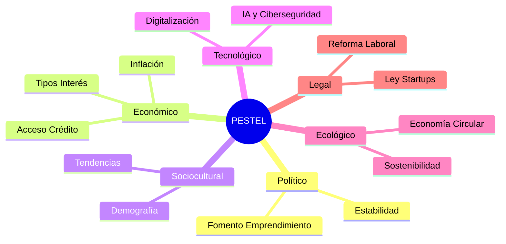
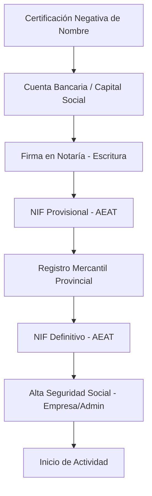

# Módulo 1: La PYME en el Entorno General de la Empresa (15 Horas)

Este módulo proporciona una base sólida sobre el ecosistema empresarial, el marco legal y los trámites de constitución en España, con especial foco en las startups y la Ley "Crea y Crece".

---

## 1.1. La Empresa y el Entorno Empresarial

La empresa es un sistema abierto que interactúa con su entorno. Para una gestión eficaz de 60 horas, profundizamos en las herramientas de análisis:

### El Macroentorno: Análisis PESTEL

1.  **Político:** Estabilidad gubernamental, políticas de fomento al emprendimiento.
2.  **Económico:** Tipos de interés, inflación, acceso al crédito (ICO, ENISA).
3.  **Sociocultural:** Tendencias de consumo, pirámide poblacional, niveles de formación.
4.  **Tecnológico:** Digitalización, IA, ciberseguridad.
5.  **Ecológico:** Normativa de emisiones, sostenibilidad y economía circular.
6.  **Legal:** Reformas laborales, Ley de Startups (28/2022), protección de datos.

### El Microentorno: Las 5 Fuerzas de Porter
*   **Poder de negociación de proveedores:** ¿Dependemos de un solo proveedor tecnológico?
*   **Poder de negociación de clientes:** ¿Tenemos clientes atomizados o un único gran cliente?
*   **Amenaza de nuevos competidores:** Barreras de entrada (capital, tecnología).
*   **Amenaza de productos sustitutivos:** Innovación disruptiva.
*   **Rivalidad entre competidores existentes:** Guerra de precios, diferenciación.

## 1.2. Tipologías de Empresas. La PYME

En España, el 99% del tejido empresarial son PYMES. Según la clasificación europea:

| Categoría | Empleados | Volumen de Negocio | Balance General |
| :--- | :--- | :--- | :--- |
| **Microempresa** | < 10 | ≤ 2 M€ | ≤ 2 M€ |
| **Pequeña** | < 50 | ≤ 10 M€ | ≤ 10 M€ |
| **Mediana** | < 250 | ≤ 50 M€ | ≤ 43 M€ |

## 1.3. Puesta en Marcha de una Empresa

El "Camino del Emprendedor" requiere una planificación técnica rigurosa:
1.  **Validación de la Idea:** Lean Startup y MVP (Producto Mínimo Viable).
2.  **Plan de Empresa (Business Plan):** Resumen ejecutivo, análisis de mercado, plan de ventas, plan de operaciones y plan financiero a 3-5 años.
3.  **Búsqueda de Financiación:** Inversores ángeles (Business Angels), capital riesgo (Venture Capital) o bootstrapping.

## 1.4. Formas Jurídicas de una Empresa

La elección depende del número de socios, la responsabilidad y el capital.

### A. Empresario Individual (Autónomo)
*   **Gestión:** Sencilla y económica.
*   **Responsabilidad:** Ilimitada (responde con su patrimonio presente y futuro).
*   **Fiscalidad:** IRPF (progresivo).

### B. Sociedad de Responsabilidad Limitada (S.L.) - La más común
*   **Capital Mínimo:** 1 € (según la **Ley 18/2022 de Creación y Crecimiento de Empresas - "Crea y Crece"**), eliminando la barrera de los 3.000 € iniciales. No obstante, se debe destinar el 20% del beneficio a reserva legal hasta alcanzar dicha cifra.
*   **Responsabilidad:** Limitada al capital aportado.
*   **Fiscalidad:** Impuesto sobre Sociedades (Tipo general 25%, 15% para nuevas empresas y startups según la **Ley 28/2022 de Fomento del Ecosistema de Empresas Emergentes**).

### Recursos Específicos en la Comunidad de Madrid
- **Ventanilla Única Empresarial (VUE) de Madrid:** Punto de tramitación unificada para agilizar la constitución.
- **Portal del Emprendedor (CAM):** Acceso a ayudas específicas para el inicio de actividad y asesoramiento personalizado.
- **Red de Puntos de Atención al Emprendedor (PAE):** Localizados en toda la región para el uso del Documento Único Electrónico (DUE).

### C. Sociedad Anónima (S.A.)
*   **Capital Mínimo:** 60.000 €.
*   **Uso:** Grandes empresas o aquellas que pretenden cotizar en bolsa.

## 1.5. Constitución de una Empresa: Trámites de Obligado Cumplimiento

Paso a paso detallado para una startup en 2026:

1.  **Registro Mercantil Central:** Obtención de la Certificación Negativa de Denominación (duración: 3-6 meses de reserva).
2.  **Cuenta Bancaria:** Ingreso del capital social (opcional si es aportación no dineraria).
3.  **Notaría:** Firma de la Escritura Pública de Constitución y aprobación de Estatutos.
4.  **Hacienda (AEAT):** Solicitud del NIF provisional (Modelo 036).
5.  **Registro Mercantil Provincial:** Inscripción de la escritura.
6.  **Hacienda (AEAT):** Obtención del NIF definitivo.
7.  **Seguridad Social:** Inscripción de la empresa (Modelo TA.6) y alta del administrador (RETA o Régimen General).

## 1.6. Conceptos y Expresiones Clave

*   **Pacto de Socios:** Contrato privado que regula las relaciones entre socios y previene conflictos.
*   **Vesting:** Cláusula para que los socios o empleados clave ganen sus participaciones progresivamente (aprox. 4 años).
*   **Burn Rate:** Velocidad a la que una startup gasta su caja antes de ser rentable.
*   **Escalabilidad:** Capacidad de crecer ingresos sin aumentar costes proporcionalmente.

## 1.7. Ciclo de Vida de una PYME

1.  **Semilla (Seed):** Ideación y validación.
2.  **Arranque (Early Stage):** Primeras ventas y búsqueda de *market fit*.
3.  **Crecimiento (Growth):** Expansión, nuevas rondas de inversión.
4.  **Madurez:** Rentabilidad estable o salida (*Exit* vía venta o IPO).

---

## 🚀 Caso de Uso Real: CyberAI Solutions S.L. (Módulo 1)

**Contexto:** Tres ingenieros de la Politécnica de Madrid desarrollan un algoritmo de IA para detectar ciberataques en tiempo real. Deciden crear **CyberAI Solutions S.L.** en el "Distrito Madrileño de la Innovación".

**Problemática:**
El CTO ha desarrollado el código base, el CEO aporta 30.000 € y el Lead Researcher aporta los modelos de IA. Temen que, si uno se marcha a los 6 meses, se lleve el 33% de la empresa y la propiedad intelectual del código.

**Resolución:**
1.  **Trámite de Constitución:** Utilizan la **VUE de Madrid** para constituirse en 48h con un capital de 3.000 € (para mostrar solvencia ante bancos).
2.  **Protección de Activos:** Firman un contrato de **cesión de Propiedad Intelectual** de los socios a la S.L. como condición previa.
3.  **Pacto de Socios:** Incluyen una cláusula de **Vesting** de 4 años con un 1 año de **Cliff** (si te vas antes del año, no tienes acciones; a partir del año, consolidas el 25% anual).
4.  **Sede:** Alquilan un espacio en una incubadora de la CAM para reducir el *burn rate* inicial.

---

**Caso 1.2: Del Autónomo a la S.L.U. (Blindaje de Responsabilidad)**
- **Contexto:** Un desarrollador IA en Madrid (autónomo) firma su primer gran contrato de 100.000 € con una multinacional.
- **Problemática:** La cláusula de responsabilidad del contrato es ilimitada. Como autónomo, si comete un error grave en el código, Hacienda o el cliente podrían embargar su vivienda personal.
- **Resolución:** Realiza una **aportación de rama de actividad** para constituir una **S.L.U.** (Sociedad Limitada Unipersonal). Ahora la responsabilidad queda limitada al capital de la sociedad, protegiendo su patrimonio personal.

**Caso 1.3: La Sede Híbrida (Coworking vs Domicilio)**
- **Contexto:** Una startup de 4 empleados trabaja en remoto pero necesita una imagen profesional en Madrid.
- **Problemática:** No pueden pagar 2.000 €/mes de oficina. Sin embargo, necesitan un domicilio social "prestigioso" para el Registro Mercantil y para recibir notificaciones de la AEAT.
- **Resolución:** Contratan un servicio de **domicilio social y fiscal** en un espacio de coworking en el centro de Madrid (Calle Gran Vía). Esto les permite cumplir con la ley y usar salas de reuniones puntuales para inversores, manteniendo costes fijos bajos (<100 €/mes).

**Caso 1.4: El Fundador Internacional (Visa de Emprendedor)**
- **Contexto:** El CTO de la startup es de San Francisco y no tiene nacionalidad europea.
- **Problemática:** La constitución de la empresa se bloquea porque el socio no tiene NIE ni permiso de trabajo inicial en España.
- **Resolución:** Aplican a la **Autorización de Residencia para Emprendedores** al amparo de la **Ley de Startups**. Al ser un proyecto de "alto contenido tecnológico" y ubicarse en Madrid, la UGE (Unidad de Grandes Empresas) aprueba el visado profesional en 20 días, permitiéndole ser administrador de la S.L.

---

### 📝 Casos Prácticos de Profundización
**Caso 1: La Responsabilidad del Autónomo.** Un diseñador autónomo comete un error legal en una campaña que cuesta 50.000 € a su cliente. Si su patrimonio personal es de 20.000 € en el banco y un coche valorado en 10.000 €, ¿qué sucede con el resto de la deuda?
**Caso 2: Constitución Express.** Investiga el funcionamiento de los Puntos de Atención al Emprendedor (PAE) y el Documento Único Electrónico (DUE). ¿Cuánto tiempo y dinero se ahorra respecto al método tradicional?

### 💡 Autoevaluación (Módulo 1)
1. ¿Cuál es el capital mínimo legal para una S.L. tras la Ley Crea y Crece?
2. Define la diferencia entre Microentorno y Macroentorno.
3. ¿Qué modelo de Hacienda se utiliza para solicitar el NIF?

### 📚 Glosario Expandido
- **CIF/NIF:** Código de Identificación Fiscal / Número de Identificación Fiscal.
- **Escritura Pública:** Documento redactado por un Notario que da fe de la constitución.
- **Estatutos Sociales:** Normas internas que rigen el funcionamiento de la sociedad.

---
**Recursos Útiles:**
- [Portal PAE - Creación telemática](https://pae.pyme.gob.es/)
- [Notariado - Guía para la constitución](https://www.notariado.org/portal/constitucion-de-sociedades)
- [ENISA - Préstamos participativos para startups](https://www.enisa.es/)
