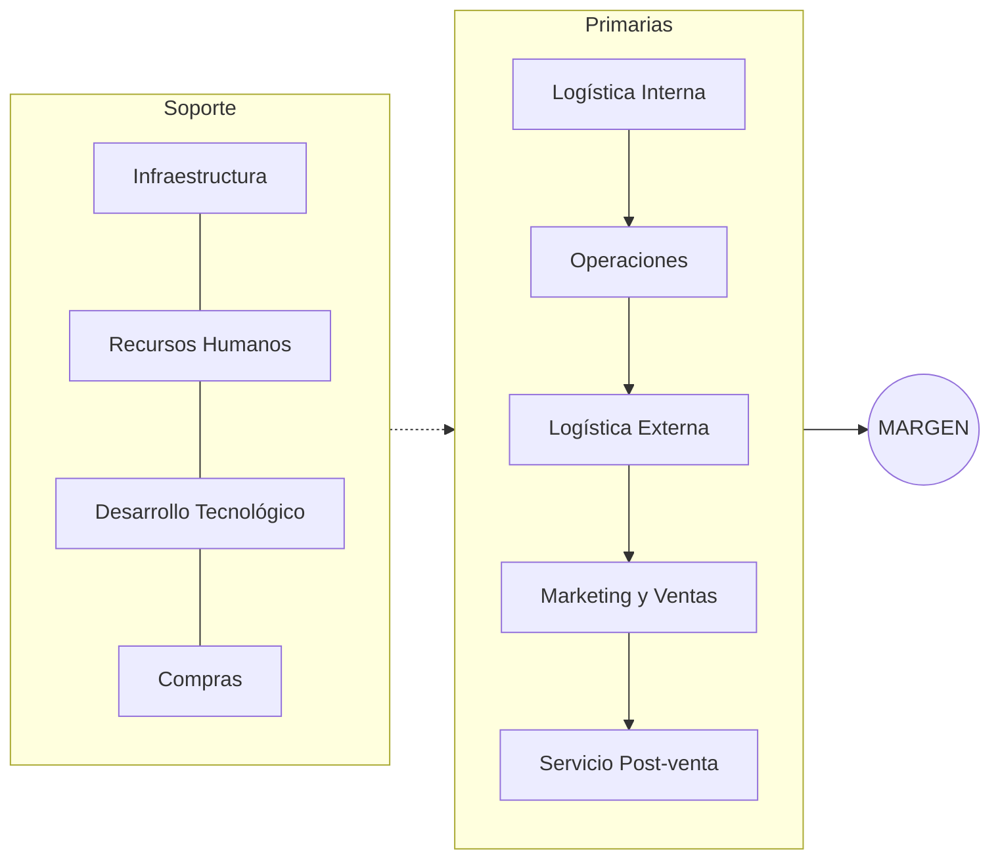
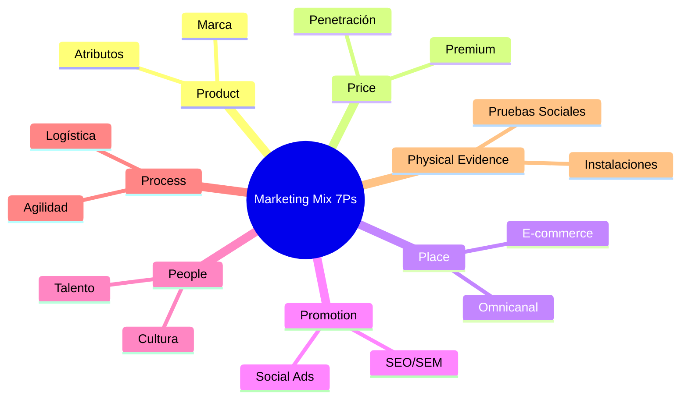
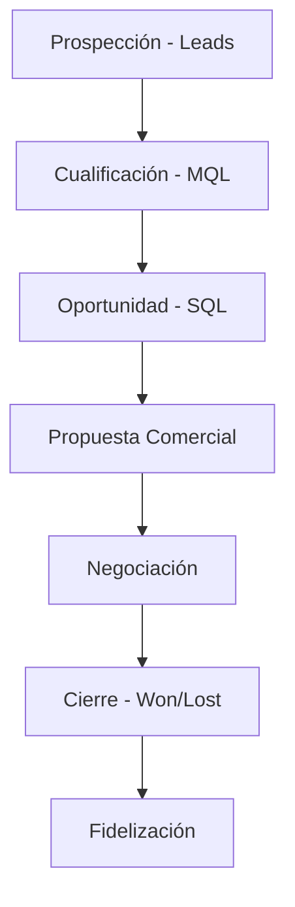

# Módulo 2: Gestión de las Áreas Funcionales Principales de una PYME (15 Horas)

Este módulo profundiza en la estructura organizativa y operativa de una PYME, desde la planificación estratégica de alto nivel hasta la gestión táctica de los recursos humanos y la producción.

---

## 2.1. Estrategia Empresarial: El Timón de la PYME

La estrategia no es solo para grandes corporaciones. Una PYME debe actuar con agilidad estratégica.

### Herramientas de Planificación de Alto Nivel
1.  **Misión, Visión y Valores:** El porqué, el hacia dónde y el cómo de la empresa.
2.  **Matriz de Ansoff:** Estrategias de crecimiento (Penetración de mercado, Desarrollo de productos, Desarrollo de mercados, Diversificación).
3.  **Cadena de Valor de Porter:** Identificación de las actividades primarias (logística, operaciones, ventas) y de soporte (infraestructura, RRHH, tecnología) que generan valor real.

### Impulso Estratégico en la Comunidad de Madrid
- **Cheque Innovación:** Ayudas directas para la contratación de servicios de apoyo a la innovación.
- **Programa de Digitalización (CAM):** Subvenciones para la implantación de soluciones de industria 4.0 y e-commerce.
- **Clusters de Innovación:** Aprovechamiento de la red de clusters regionales (Aeroespacial, Biotecnología, Movilidad) para generar sinergias competitivas.

4.  **Cuadro de Mando Integral (Balanced Scorecard):** Perspectiva financiera, del cliente, de procesos internos y de aprendizaje/crecimiento.

## 2.2. Dirección de Márketing: De las 4Ps a las 7Ps

En el entorno actual de servicios y productos digitales, el márquetin se expande:

- **Product:** Atributos, marca y packaging.
- **Price:** Estrategias de penetración, premium o descremación.
- **Place:** Omnicanalidad (e-commerce + retail).
- **Promotion:** Marketing digital (SEO, SEM, Social Ads).
- **People:** El personal que interactúa con el cliente.
- **Process:** Rapidez de entrega y atención al cliente.
- **Physical Evidence:** Pruebas físicas de la calidad del servicio (reviews, instalaciones).

## 2.3. Dirección Comercial y Técnicas de Venta

La venta es la sangre del negocio. Analizamos el ciclo comercial:

1.  **Prospección:** Identificación de *leads*.
2.  **Técnica SPIN Selling:** (Situación, Problema, Implicación, Necesidad de beneficio) para ventas B2B complejas.
3.  **Gestión del Embudo de Ventas (Sales Funnel):** Conversión de leads en clientes reales.
4.  **CRM (Customer Relationship Management):** Software imprescindible (HubSpot, Salesforce, Pipedrive) para no perder oportunidades.

## 2.4. Dirección de Producción: Plan de Producción y Compras

Optimizar los recursos para maximizar el margen:
- **Métodos Lean:** Eliminación de *desperdicios* (muda) en los procesos.
- **Just In Time (JIT):** Reducción de inventarios al mínimo necesario.
- **Clasificación ABC de Inventarios:** Centrar el control en los productos de más valor (A) que representan el mayor porcentaje del stock.
- **Gestión de Compras:** Homologación de proveedores y negociación de rappels por volumen.

## 2.5. Dirección Financiera: La Salud del Negocio

Más allá de la contabilidad, la dirección financiera toma decisiones de capital:
*   **Gestión de la Tesorería (Cash Management):** Previsión de entradas y salidas para evitar el "valle de la muerte".
*   **Análisis del Punto de Equilibrio (Break-even Point):** ¿Cuántas unidades debemos vender para no perder dinero?
*   **KPIs Financieros:** ROE (Rentabilidad sobre Fondos Propios), ROI (Rentabilidad de la Inversión) y Margen Bruto.

## 2.6. Dirección de Recursos Humanos: Gestión del Talento

En las PYMES tecnológicas, el conocimiento reside en las personas:
- **Employer Branding:** Convertir la empresa en un lugar atractivo para trabajar.
- **Selección por Competencias:** Buscar *soft skills* (agilidad, resiliencia) además de conocimientos técnicos.
- **Metodología OKR (Objectives and Key Results):** Alineación de los objetivos individuales con los de la empresa (Google system).
- **Retención del Talento:** Planes de carrera, flexibilidad laboral y "salario emocional".

---

## 🚀 Caso de Uso Real: CyberAI Solutions S.L. (Módulo 2)

**Contexto:** CyberAI ya tiene un producto operativo. Sus clientes potenciales son bancos y aseguradoras de la Comunidad de Madrid.

**Problemática:**
El ciclo de venta es de 12 meses. Los directores de seguridad (CISOs) son reacios a integrar nuevas IAs. El "burn rate" es alto y el equipo de ventas (2 personas) está frustrado por la falta de cierres.

**Resolución:**
1.  **Estrategia:** Pivotan de vender "licencias perpetuas" a un modelo **SaaS** con cuotas mensuales, facilitando la aprobación presupuestaria del cliente.
2.  **Márquetin (7Ps):** Refuerzan la **Physical Evidence** mediante certificaciones de seguridad (ISO 27001) para generar confianza técnica.
3.  **Ventas (Funnel):** Implementan **PoCs (Pruebas de Concepto)** de 3 meses. Si el software detecta una amenaza real en ese tiempo, el cierre es automático.
4.  **Networking Regional:** Se unen al **Cyber Cluster de Madrid**, lo que les permite acceder a grandes cuentas mediante recomendaciones de confianza (*referrals*).

---

**Caso 2.2: Logística y Compras Deep-Tech (Hardware AI)**
- **Contexto:** CyberAI desarrolla un dispositivo de seguridad física con IA (Edge Computing).
- **Problemática:** Necesitan componentes muy específicos que vienen de Asia. Si piden demasiados, agotan su caja (liquidez); si piden pocos, no cumplen con los pedidos (rotura de stock).
- **Resolución:** Implementan una gestión de compras **Just In Time (JIT)** con un proveedor en un polígono industrial de Madrid que actúa como importador. Aplican el **Análisis ABC** para tener stock de seguridad solo de los componentes más críticos (A) y reducir el volumen de los menos costosos (C).

**Caso 2.3: Márquetin de Autoridad (Growth Hacking B2B)**
- **Contexto:** La startup no tiene presupuesto para publicidad en ferias internacionales.
- **Problemática:** Su público objetivo (CISOs de IBEX 35) no responde a llamadas frías ni a anuncios convencionales.
- **Resolución:** Apuestan por el **Márquetin de Contenidos Técnicos**. Publican un "Whitepaper" sobre fallos de seguridad en la IA generativa que se vuelve viral en LinkedIn entre expertos. El CTO imparte un webinar gratuito. Resultado: 50 *leads* cualificados de alta calidad con coste de adquisición (CAC) cercano a cero.

**Caso 2.4: Gestión de Equipos Ágiles (SCRUM en 5 personas)**
- **Contexto:** El equipo crece de 3 a 7 personas en 3 meses. Las reuniones se eternizan y el desarrollo se retrasa.
- **Problemática:** Los comerciales prometen funciones que los desarrolladores aún no han probado, creando silos de información.
- **Resolución:** Implementan una metodología **Lean-Agile** adaptada: reuniones diarias de 10 min (Daily Standup) y un tablero **Kanban** visual para priorizar tareas. Al final de cada mes, revisan los **OKRs** (Ej: Objetivo - "Lanzar v2", Key Result - "Cero bugs críticos").

---

### 📝 Casos Prácticos de Profundización
**Caso 1: El Embudo de Ventas.** Una startup de software (SaaS) atrae 1.000 visitas al mes, de las cuales 100 se registran para la prueba gratuita. Al final, solo 5 compran la suscripción. ¿Cuál es el ratio de conversión final y cuáles podrían ser las causas de la pérdida de clientes en el paso de "prueba" a "pago"?
**Caso 2: Inventario ABC.** Clasifica 5 productos de una tienda de electrónica basándote en su valor y rotación. ¿A cuáles dedicarías más tiempo de control de stock?

### 💡 Autoevaluación (Módulo 2)
1. ¿Cuáles son las 4 perspectivas del Cuadro de Mando Integral?
2. Explica la diferencia entre precio de penetración y precio premium.
3. ¿Qué significan las siglas OKR en gestión de equipos?

### 📚 Glosario Expandido
- **SaaS:** Software as a Service.
- **Lead:** Cliente potencial que ha mostrado interés.
- **Punto de Equilibrio:** Nivel de ventas donde los ingresos igualan a los costes totales (beneficio cero).

---
**Recursos Útiles:**
- [Cámara de Comercio - Guía de Estrategia](https://www.camara.es/)
- [HubSpot Academy - Curso de Ventas e Inbound](https://academy.hubspot.es/)
- [Lean Enterprise Institute - Principios Lean](https://www.lean.org/)
