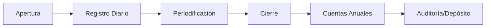
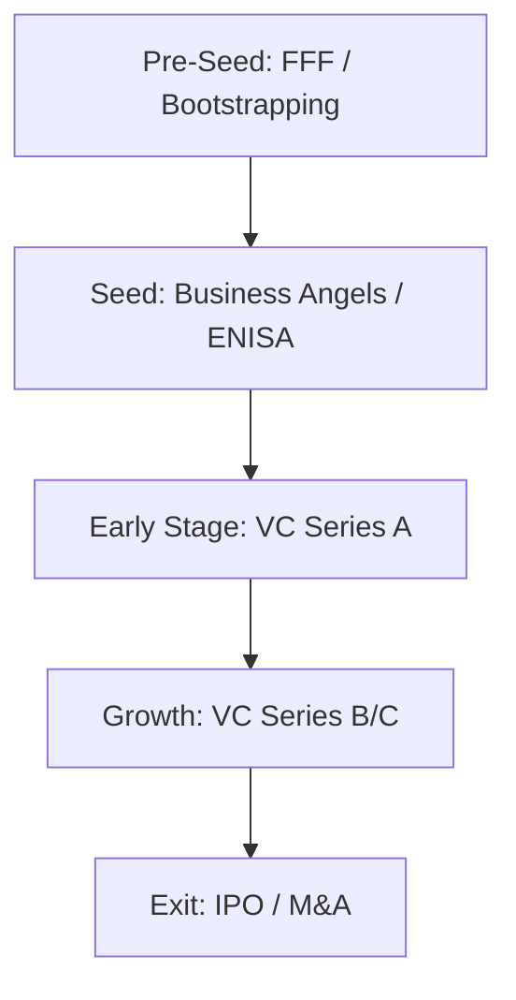
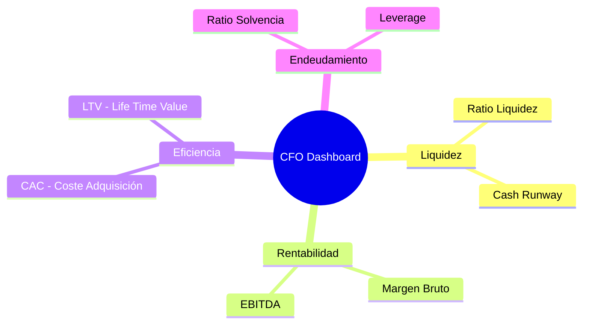

# Módulo 3: Gestión Económico-Financiera en la PYME (15 Horas)

Este módulo profundiza en los mecanismos contables, financieros y de control que permiten a una PYME ser rentable, solvente y sostenible en el tiempo.

---

## 3.1. Contabilidad: El Plan General Contable (PGC)

La contabilidad no es solo una obligación fiscal, es la base de la toma de decisiones.

### Estructura del PGC (Adaptado a PYMES)
1.  **Grupos 1 al 5:** Cuentas de Balance (Patrimonio Neto, Pasivo, Activo).
2.  **Grupos 6 y 7:** Cuentas de Gestión (Compras/Gastos y Ventas/Ingresos).
3.  **Documentos Obligatorios (Cuentas Anuales):**
    *   **Balance de Situación:** Activo (lo que tenemos) = Pasivo + Patrimonio Neto (quién lo ha financiado).
    *   **Cuenta de Pérdidas y Ganancias (PyG):** Detalle de beneficios o pérdidas del ejercicio.
    *   **Memoria:** Explicación cualitativa de los datos cuantitativos.
    *   **Estado de Cambios en el Patrimonio Neto:** Registro de las variaciones del capital.

## 3.2. Fuentes de Financiación para la PYME: De la Deuda al Venture Capital

Para 15 horas de formación, analizamos la estructura de capital según la fase de vida de la empresa:

### Financiación según Madurez
- **Fase Seed:** FFF (Friends, Family and Fools), Business Angels.
- **Fase Expansion:** Venture Capital (Series A, B...) y Private Equity.
- **Financiación Bancaria Tradicional:** Pólizas de crédito, descuento comercial (factoring) y confirming.
- **Instrumentos Alternativos en Madrid:**
    *   **Avalmadrid S.G.R.:** Sociedad de Garantía Recíproca que facilita el acceso al crédito bancario mediante avales para autónomos y PYMES de la región.
    *   **Deducción Regional IRPF (CAM):** Incentivo del 40% (o 50% en ciertos casos) de las cantidades invertidas por los socios en la suscripción de acciones o participaciones de empresas de nueva o reciente creación.
    *   **Préstamos ENISA:** Financiación sin avales para proyectos innovadores a nivel nacional.

## 3.3. Contabilidad de Costes y Márgenes

Es fundamental saber cuánto nos cuesta realmente producir:
- **Direct Costing:** Solo imputa los costes variables al producto.
- **Full Costing:** Imputa costes fijos y variables (reparto de amortizaciones, luz, alquiler).
- **Margen de Contribución:** Ventas - Costes Variables. Debe ser positivo para cubrir los costes fijos.
- **EBITDA vs. EBIT:** El EBITDA elimina el impacto de la estructura financiera y fiscal (intereses e impuestos) y de las amortizaciones para ver la rentabilidad operativa pura.

## 3.4. Control de Gestión y Análisis de Ratios

Un CFO de startup debe monitorizar el negocio en tiempo real:

*   **Ratio de Liquidez:** Activo Corriente / Pasivo Corriente (capacidad de pago a corto plazo).
*   **Ratio de Endeudamiento:** Pasivo Total / Patrimonio Neto (nivel de apalancamiento).
*   **Periodo Medio de Maduración:** Días que transcurren desde que compramos materia prima hasta que cobramos del cliente.
*   **Dashboards:** Integración de datos en tiempo real (Google Data Studio, Power BI).

## 3.5. Gestión de la Calidad (ISO 9001:2015)

Implementar un Sistema de Gestión de la Calidad (SGC):
1.  **Enfoque al Cliente:** Superar expectativas.
2.  **Liderazgo y Compromiso:** Implicación de la dirección.
3.  **Mejora Continua (Ciclo PDCA):** Planificar, Hacer, Verificar, Actuar.
4.  **Gestión de Riesgos y Oportunidades.**

## 3.6. Responsabilidad Social Corporativa (RSC) y Sostenibilidad

La PYME y su impacto en los ODS (Objetivos de Desarrollo Sostenible):
- **Eje Social:** Igualdad de género, conciliación y fomento de la economía local.
- **Eje Ambiental:** Gestión de residuos, reducción de huella de carbono y eficiencia energética.
- **Eje de Gobernanza:** Código ético y transparencia con inversores.

---

## 🚀 Caso de Uso Real: CyberAI Solutions S.L. (Módulo 3)

**Contexto:** CyberAI ha validado su tecnología, pero el coste de los servidores de GPU para su IA y los salarios de ingenieros senior han disparado el *burn rate* a 40.000 €/mes.

**Problemática:**
Solo quedan 60.000 € en la cuenta bancaria (1,5 meses de vida). Si no consiguen capital antes de dos meses, deberán cerrar o despedir al equipo clave.

**Resolución:**
1.  **Ronda Seed:** Consiguen 300.000 € de un grupo de **Business Angels** madrileños.
2.  **Apalancamiento Público:** Al ser una empresa de base tecnológica e innovadora, solicitan un préstamo **Enisa Jóvenes Emprendedores** de 150.000 € (sin avales, solo con la garantía del proyecto).
3.  **Puente de Tesorería:** Los fondos de Enisa tardan 4 meses en llegar. Para cubrir el bache, solicitan un préstamo puente a su entidad bancaria avalado al 50% por **Avalmadrid S.G.R.**
4.  **Control de KPIs:** El CFO implementa un *dashboard* para vigilar obsesivamente el **Runway** (meses de vida antes de agotar la caja) y el **Burn Rate**.

---

**Caso 3.2: Monetización de la I+D (Tax Lease)**
- **Contexto:** CyberAI invierte 200.000 € anuales en I+D, lo que genera una deducción fiscal importante.
- **Problemática:** La empresa está en pérdidas (habitual en startups), por lo que no puede aplicarse la deducción en su Impuesto sobre Sociedades. Necesitan caja hoy, no dentro de 5 años.
- **Resolución:** Utilizan el mecanismo de **Tax Lease**. Venden su derecho a la deducción por I+D a un inversor tercero (una empresa con beneficios en Madrid) a cambio de una inyección de liquidez inmediata de unos 50.000 €. Esto mejora el *cash-flow* sin dilución de acciones.

**Caso 3.3: El Riesgo de Divisa (Forex en Ventas USA)**
- **Contexto:** CyberAI consigue su primer gran contrato en EE.UU. por valor de 200.000 $.
- **Problemática:** Los gastos de la empresa (salarios, alquiler en Madrid) son en Euros (€). Si el dólar se devalúa un 10% antes de cobrar la factura a 90 días, la startup perderá 20.000 € de margen real.
- **Resolución:** El CFO contrata un **Seguro de Cambio** (Forward) con su banco, fijando hoy un tipo de cambio €/$ para la fecha de cobro. Así eliminan el riesgo de volatilidad y aseguran el margen operativo en euros.

**Caso 3.4: Limpieza de la "Cap Table" (Sindicación de Inversores)**
- **Contexto:** En la primera ronda entraron 25 familiares y amigos (*FFF*) con aportaciones de entre 1.000 € y 5.000 €.
- **Problemática:** Para firmar cualquier decisión en la Junta General, el CEO tiene que perseguir a 25 personas para que firmen ante notario, lo que ralentiza la gestión y asusta a los fondos de Capital Riesgo (VC).
- **Resolución:** Proponen un **Acuerdo de Sindicación de Voto**. Todos los pequeños inversores nombran a un representante único (ej. el CEO o un inversor líder) para que vote y firme en su nombre. La Cap Table se vuelve "limpia" y atractiva para inversores profesionales.

---

### 📝 Casos Prácticos de Profundización
**Caso 1: El Balance Desequilibrado.** Analiza una empresa con un Activo Corriente de 10.000 € y un Pasivo Corriente (deudas a < 1 año) de 25.000 €. ¿Qué problema presenta y qué soluciones financieras propondrías para evitar el concurso de acreedores?
**Caso 2: Rentabilidad vs. Caja.** Una empresa vende 1M€ este año (beneficio de 200.000 €), pero quiebra por falta de caja. Explica cómo es posible analizando el Periodo Medio de Cobro.

### 💡 Autoevaluación (Módulo 3)
1. ¿Qué estados financieros forman las Cuentas Anuales Abreviadas?
2. ¿Qué diferencia hay entre un préstamo ICO y un préstamo ENISA?
3. ¿Cuál es la fórmula del Margen de Contribución?

### 📚 Glosario Expandido
- **Amortización:** Registro contable de la depreciación de un bien (ej. un coche pierde valor cada año).
- **Factoring:** Cesión de las facturas de clientes a una entidad financiera para cobrar el dinero por adelantado.
- **Liquidez:** Capacidad de la empresa para convertir sus activos en dinero efectivo.

---
**Recursos Útiles:**
- [ICAC - Texto del Plan General Contable](http://www.icac.meh.es/)
- [ENISA - Líneas de Financiación](https://www.enisa.es/)
- [AENOR - Certificación ISO 9001](https://www.aenor.com/certificacion/calidad/iso-9001)
