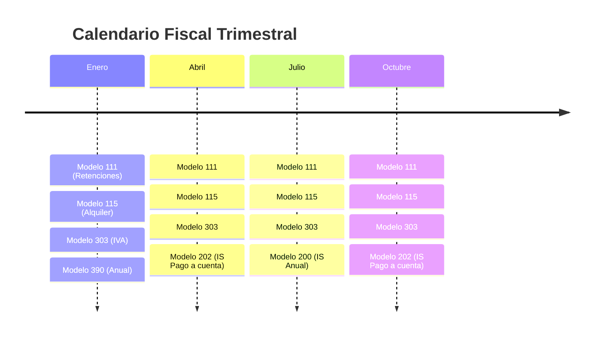
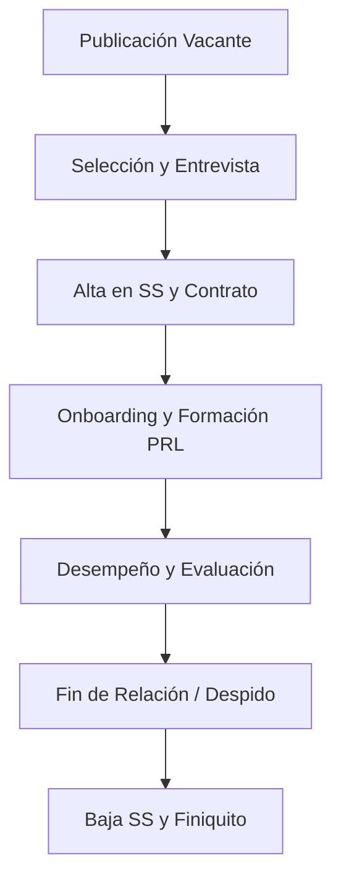
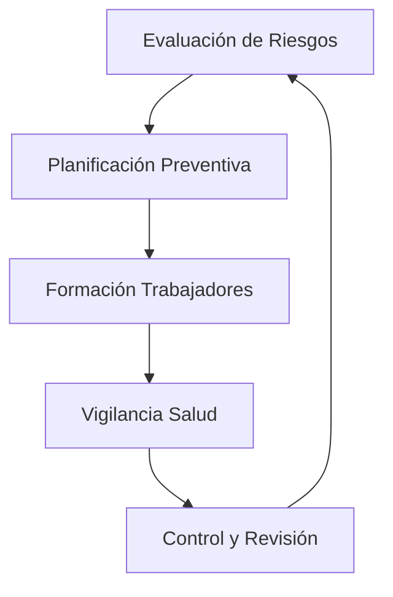

# Módulo 4: Fiscalidad, Tributación y Legislación Laboral en la PYME (15 Horas)

Este módulo aborda de forma exhaustiva el marco regulatorio tributario, laboral y preventivo que afecta a la PYME, asegurando el cumplimiento normativo ("Compliance") y evitando sanciones.

---

## 4.1. Obligaciones Fiscales como Autónomo (IRPF e IVA)

El autónomo debe conocer su calendario fiscal para evitar recargos (de hasta el 20%).

### Tributación por IRPF
1.  **Estimación Directa (Simplificada o Normal):** Tributación por el rendimiento neto (Ingresos - Gastos deducibles).
2.  **Tarifa Cero (Comunidad de Madrid):** Subvención del 100% de la cuota de autónomos durante el primer año (ampliable al segundo si no se superan niveles de ingresos) para nuevos trabajadores por cuenta propia en la región.
3.  **Modelo 130:** Pago fraccionado trimestral (20% del rendimiento neto acumulado).
4.  **Modelo 100:** Declaración de la Renta anual.

### Tributación por IVA (Impuesto sobre el Valor Añadido)
- **IVA Repercutido:** El que cobramos a los clientes (deuda con Hacienda).
- **IVA Soportado Deducible:** El que pagamos a proveedores (derecho de deducción).
- **Modelo 303:** Liquidación trimestral (Repercutido - Soportado). Si es negativo, se compensa; si es positivo, se paga.

## 4.2. Obligaciones Fiscales como Sociedad (Impuesto sobre Sociedades)

Las sociedades limitadas (S.L.) tienen un régimen fiscal diferente:

### Impuesto sobre Sociedades (IS)
*   **Modelo 200:** Declaración anual (se presenta en julio).
*   **Modelo 202:** Pagos a cuenta (abril, octubre, diciembre) si se obtuvo beneficio el año anterior.
*   **Retenciones (Modelos 111 y 115):** La empresa actúa como "recaudadora" para Hacienda al retener parte del salario de sus empleados o del alquiler de sus oficinas.

### Otras Obligaciones Censales
- **Modelo 347:** Operaciones con terceros que superen los 3.005,06 € anuales.
- **Modelo 036:** Alta, modificación o baja en el censo de empresarios.

## 4.3. Legislación Laboral: El Estatuto de los Trabajadores

La reforma laboral de 2021 ha cambiado el panorama de contratación:

### Tipos de Contrato en 2026
1.  **Indefinido:** Es la norma general (puede ser a tiempo completo, parcial o fijo-discontinuo).
2.  **Contrato por Circunstancias de la Producción:** Duración máxima de 6 meses (ampliable a 1 año por convenio).
3.  **Contrato para la Formación y el Aprendizaje:** Para jóvenes sin titulación.
4.  **Contrato para la Obtención de Práctica Profesional:** Para titulados recientes.

### Gestión de Nóminas y Seguridad Social
- **Estructura de la Nómina:** Salario Base + Complementos + Prorrateo pagas extras.
- **SMI 2026:** El Salario Mínimo Interprofesional se sitúa en **1.134 € brutos mensuales** (en 14 pagas) o 1.323 € (con pagas prorrateadas), sumando un total anual de 15.876 €.
- **Ayudas a la Contratación (CAM):** Programas de subvenciones de la Comunidad de Madrid para la contratación indefinida de jóvenes y personas desempleadas del sector tecnológico.
- **Cotización a la SS:** A cargo de la empresa (aprox. 30-34%) y a cargo del trabajador (aprox. 6,4%).

## 4.4. Medioambiente y Seguridad Laboral (PRL)

El incumplimiento en estas áreas puede acarrear multas muy elevadas e incluso responsabilidad penal.

### Prevención de Riesgos Laborales (Ley 31/1995)
*   **Plan de Prevención:** Definición de la estructura organizativa y las responsabilidades.
*   **Evaluación de Riesgos:** Identificación de riesgos por puesto de trabajo.
*   **Plan de Emergencia y Evacuación:** Obligatorio para todos los centros de trabajo.
*   **Formación del Trabajador:** Obligatoria y en horario laboral.
*   **Vigilancia de la Salud:** Reconocimientos médicos periódicos.

### Responsabilidades Medioambientales e ISO 14001
- **Gestión de Residuos:** Identificación de residuos peligrosos (ej. tóner, pilas, equipos electrónicos) y gestión vía gestor autorizado.
- **Eficiencia Energética:** Implementación de medidas para reducir el consumo y la huella de carbono.
- **Responsabilidad Medioambiental:** Obligación de prevenir y reparar daños según la Ley 26/2007.

---

## 🚀 Caso de Uso Real: CyberAI Solutions S.L. (Módulo 4)

**Contexto:** CyberAI necesita contratar urgentemente a un Director de Investigación de IA. Han encontrado al candidato ideal, pero tiene una oferta de una multinacional por 120.000 € anuales.

**Problemática:**
CyberAI no puede pagar más de 85.000 € brutos sin comprometer su viabilidad. El candidato es de Madrid, tiene menos de 30 años y es doctor en IA.

**Resolución:**
1.  **Ley de Startups (Fiscalidad):** Al estar certificados como empresa emergente por ENISA, ofrecen un plan de **Stock Options** (opciones sobre acciones). Los primeros 50.000 € anuales de este incentivo están **exentos de tributación** para el trabajador, lo que eleva el valor real del paquete por encima de la oferta de la multinacional.
2.  **Incentivo Regional:** Aplican a la subvención de la Comunidad de Madrid para la **contratación de doctores**, recuperando parte del coste salarial durante el primer año.
3.  **Flexibilidad Laboral:** Implementan una jornada de 4 días y **remoto 100%**, algo que la multinacional no ofrece, mejorando el "salario emocional".
4.  **Compliance:** Registran al trabajador en el sistema RED y realizan la **formación de PRL** obligatoria en ciberseguridad y ergonomía de forma telemática la primera semana.

---

**Caso 4.2: El Autónomo TRADE (Falso Autónomo vs. Realidad)**
- **Contexto:** CyberAI contrata a un consultor experto en redes para un proyecto de 6 meses. El consultor trabaja desde su casa, con su propio equipo, pero el 80% de sus ingresos provienen de CyberAI.
- **Problemática:** La Inspección de Trabajo en Madrid está muy atenta a los "falsos autónomos". Si se considera que hay dependencia y ajenidad, la multa podría ser enorme.
- **Resolución:** Firman un contrato de **Autónomo Económicamente Dependiente (TRADE)** y lo registran en el SEPE. El consultor demuestra que tiene autonomía organizativa (no cumple el horario de la oficina) y que asume su propio riesgo y ventura, cumpliendo estrictamente la Ley del Estatuto del Trabajo Autónomo.

**Caso 4.3: El "Nómada Digital" Interno (Teletrabajo Internacional)**
- **Contexto:** Un desarrollador senior de la plantilla decide mudarse a Portugal por motivos familiares pero desea seguir trabajando para la startup de Madrid.
- **Problemática:** Si sigue en la nómina española, CyberAI estaría incumpliendo la ley fiscal y de seguridad social portuguesa.
- **Resolución:** Utilizan una plataforma de **Employer of Record (EOR)** que gestiona la nómina y los impuestos en Portugal en nombre de CyberAI. El contrato se adapta a la legislación lusa, manteniendo al talento sin incurrir en riesgos de fraude a la Seguridad Social.

**Caso 4.4: Seguridad Laboral en Coworking (Coordinación de Actividades)**
- **Contexto:** CyberAI tiene su sede en un coworking de Madrid con otras 20 empresas.
- **Problemática:** Un empleado tropieza con un cable en la zona común y se lesiona. ¿Quién es responsable de la Prevención de Riesgos Laborales (PRL)?
- **Resolución:** CyberAI firma el documento de **CAE (Coordinación de Actividades Empresariales)** con el gestor del coworking. La startup es responsable de la formación de sus empleados, y el coworking garantiza la seguridad de las instalaciones comunes. La brecha se resuelve con una comunicación fluida de los riesgos compartidos.

---

### 📝 Casos Prácticos de Profundización
**Caso 1: El Despido Procedente.** Un trabajador acumula 3 faltas de asistencia sin justificar en un mes. La empresa decide despedirlo. ¿Qué tipo de despido es? ¿Tiene derecho a indemnización? ¿Y a prestación por desempleo?
**Caso 2: El IVA Trimestral.** Una startup ha facturado 10.000 € (+21% IVA) en el T1. Sus gastos afectos han sido de 4.000 € (+21% IVA). Calcula el resultado del Modelo 303 que debe presentar en abril.

### 💡 Autoevaluación (Módulo 4)
1. ¿Cuál es el porcentaje general del Impuesto sobre Sociedades para una nueva empresa?
2. ¿Qué modelo de Hacienda se utiliza para ingresar las retenciones de los trabajadores?
3. ¿Cuántos días de preaviso mínimo requiere un despido objetivo?

### 📚 Glosario Expandido
- **Devengo:** Momento en el que nace la obligación tributaria (ej. al emitir la factura, no al cobrarla).
- **Convenio Colectivo:** Acuerdo entre sindicatos y patronal que regula las condiciones laborales de un sector.
- **Base Imponible:** Montante sobre el que se aplica el porcentaje del impuesto.

---
**Recursos Útiles:**
- [AEAT - Manual de Actividades Económicas](https://www.agenciatributaria.es/)
- [Ministerio de Trabajo - SEPE](https://www.sepe.es/)
- [INSST - Prevención de Riesgos Laborales](https://www.insst.es/)
